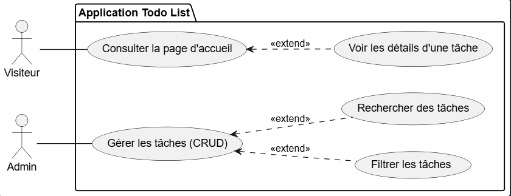
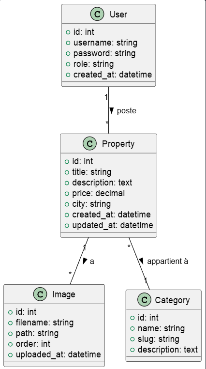

# Mini Projet  
## Plateforme de Gestion d’Annonces Immobilières

**Fonctionnalités clés :**
- CRUD des biens immobiliers
- Recherche et filtrage dynamiques
- Interface publique + back-office admin

---

## 1. Choix du Sujet

### Sujet du projet
Développement d’une mini plateforme de **gestion d’annonces immobilières**.

### Motivation
- Sujet concret et professionnel
- Très répandu dans le domaine web
- Permet de pratiquer les bases essentielles du full-stack

*Ce projet sert de test technique pour valider la maîtrise des opérations CRUD et de la recherche dynamique.*

---

## 2. Contexte

### Contexte pédagogique
Ce projet technique a pour objectif :
- D’appliquer les connaissances acquises en développement web
- De valider notre compréhension des concepts fondamentaux
- De mettre en pratique une démarche de développement structurée

### Processus de développement
- Méthodologie adoptée : **2TUP (Two-Track Unified Process)**
- Séparation claire entre :
  - Analyse & conception
  - Implémentation & validation

---

---

## 3. Besoin - Analyse Technique
### Les technologies à utiliser
1 Base de données: MySQL.
2 Framework: Laravel 12.
3 Architecture N-Tiers:
4 Controller: Requêtes HTTP.
5 Service: Logique métier.
6 Model: Base de données.
7 Architecture: MVC.
8 Blade: Templates réutilisables (components, layouts).
9 AJAX: Interactions dynamiques (ex: Modales) sans rechargement de page.
10 Téléchargement d'images: Possibilité de télécharger et de joindre des images aux notes.

---

11 Support Multi-langue: Support des langues française et anglaise (fr, en).
12 Vite: Outil de build rapide.
13 Preline UI: Librairie UI.
14 Lucide: Librairie d'icônes.
15 Tailwind CSS: Développement rapide, responsive.

---
## 4. Analyse

---

## 5. Conception

---
